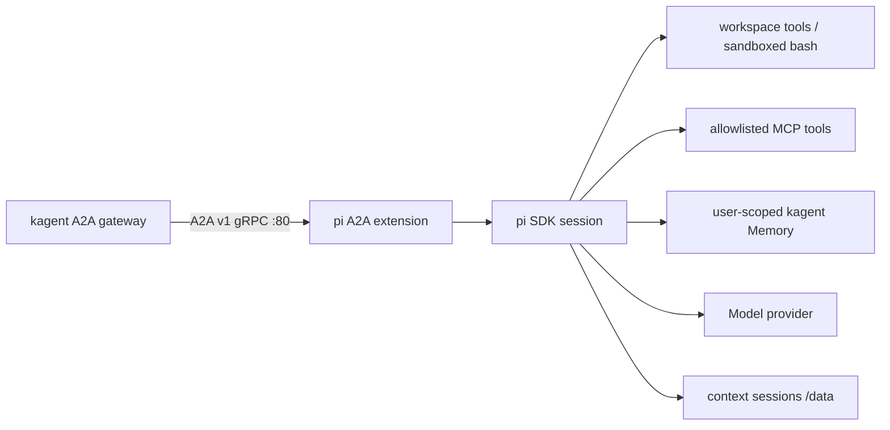

# Pi coding agent on kagent

A TypeScript BYO runtime using pi's SDK and an A2A pi extension. It supports both the `kagent.dev/v1alpha3` BYO Harness API over gRPC and legacy kagent 0.10.x `Agent` deployments over A2A v0.3 JSON-RPC.



## Layout

- `src/index.ts`: headless SDK host, model selection, durable pi session, process shutdown.
- `extensions/a2a.ts`: starts the server on `session_start` and closes it on `session_shutdown`.
- `src/server.ts`: A2A gRPC transport, optional HTTP JSON-RPC compatibility transport, agent card, and readiness.
- `src/request-handler.ts`: adapts kagent-preallocated task IDs to the upstream JS request handler.
- `src/executor.ts`: maps pi execution to upstream A2A tasks, status updates, artifacts, and cancellation.
- `src/conversation.ts`: opens a fresh execution session from durable pi history for each prompt.
- `src/context-runtime-manager.ts`: hashes A2A context IDs, manages durable per-context sessions, locks, queueing, and idle eviction.
- `src/security/` and `src/tools/`: canonical workspace path policy and Bubblewrap-backed shell tools.
- `src/integrations/`: optional MCP, trusted request identity, embedding, and kagent Memory adapters.
- `src/session-lifecycle.ts`: binds headless extensions and guarantees idempotent shutdown/disposal.
- `src/runtime-config.ts`: validates JSON lists, trusted paths, booleans, and network ports.
- `skills/`: reviewed, image-baked Agent Skills available to execution sessions.

The extension is an SDK-injected factory, not a standalone `pi -e` extension. An in-memory pi host session owns the extension lifecycle; it never prompts the model. Each A2A context maps to `/data/sessions/contexts/<sha256(contextId)>`; requests reopen and dispose that context's execution session around `session.prompt()`. Contexts have independent locks, bounded global concurrency, and idle in-memory eviction. This also avoids retaining stale history after a Substrate restore changes `/data`.

There is no second pi process, stdin RPC bridge, TUI, or dependency on UI APIs. Importing the extension does not open sockets.

`@a2a-js/sdk` supplies the `lf.a2a.v1.A2AService` implementation and generated wire bindings corresponding to [`proto/a2a.proto`](../../proto/a2a.proto). No protobuf copy or hand-maintained task schema is added here.

## Local development

Requires Node.js 22.19+ and npm. From `samples/pi-agent/`:

```sh
npm ci --ignore-scripts
npm run format
npm run check
npm test

# Use credentials, model defaults, and thinking defaults from this checkout's
# ignored .pi/agent directory.
PI_CODING_AGENT_DIR="$PWD/.pi/agent" npm run dev
```

Local defaults bind gRPC to `127.0.0.1:8080` and readiness to `127.0.0.1:8081/readyz`; the HTTP A2A transport is disabled unless `PI_HTTP_PORT` is set. The workspace and context-scoped pi sessions live in `.data/`, not your repository checkout. `PI_CODING_AGENT_DIR` may point pi's credential and model-cache lookup at another directory without moving the workspace or sessions. Bubblewrap must be installed for the `bash` tool; it fails closed when unavailable.

`npm run check` runs **Biome check and TypeScript typecheck**. `npm run format` uses **Biome format**. `npm run build && npm start` runs the compiled package.

To send a local request with `grpcurl`, run from the repository root. Supply a checkout of `googleapis` for the imports in `proto/a2a.proto`; the server does not enable reflection.

```sh
grpcurl -plaintext -H 'a2a-version: 1.0' \
  -import-path proto -import-path /path/to/googleapis -proto a2a.proto \
  -d '{"message":{"messageId":"local-message-1","contextId":"local-context","role":"ROLE_USER","parts":[{"text":"Create hello.txt containing hello."}]}}' \
  127.0.0.1:8080 lf.a2a.v1.A2AService/SendStreamingMessage
```

## Deploy on kagent 0.10.x

The checked-in `deploy-v1alpha2.yaml` is ready for the current legacy `kagent.dev/v1alpha2` cluster. It creates a PVC and a BYO `Agent`; kagent generates its Deployment and Service. First create or update the ignored OAuth Secret, then apply the manifest:

```sh
kubectl -n kagent create secret generic pi-agent-openai-codex \
  --from-file=auth.json=.pi/agent/auth.json \
  --dry-run=client -o yaml | kubectl apply -f -
kubectl apply -f deploy-v1alpha2.yaml
kubectl -n kagent wait --for=condition=Ready agent/pi-agent --timeout=5m
kagent -n kagent invoke --agent pi-agent --task '只回覆 OK，不要使用工具。'
```

This mode serves the v0.3 agent card and JSON-RPC on port 8080. Valid legacy context IDs are preserved and receive independent durable Pi histories. Very old requests without a context ID are isolated by task/message ID instead of entering a shared fallback. The manifest uses separate state and workspace PVCs, runs as UID 10001, drops capabilities, and mounts the root filesystem read-only. Before upgrading a PVC created by the older root image, back it up and change its existing files to UID/GID 10001 (for example, from the still-running old Pod: `chown -R 10001:10001 /data`).

## Deploy with BYO Harness

Requires kagent with the v1alpha3 BYO compiler, Substrate, a same-namespace WorkerPool, snapshot storage, and credentials for your model provider. You need permission to write Harnesses. Do not expose the runtime directly through a public Service or Ingress.

1. Build and publish the image, using this sample directory as build context:

   ```sh
   docker build -t ghcr.io/YOUR_ORG/pi-agent:demo samples/pi-agent
   docker push ghcr.io/YOUR_ORG/pi-agent:demo
   ```

2. Provision a Secret named `pi-agent-openai-codex` in namespace `kagent` from your pi OAuth credentials, using your normal secret-management workflow. Do not put credentials in the manifest or image. For a local test cluster:

   ```sh
   kubectl -n kagent create secret generic pi-agent-openai-codex \
     --from-file=auth.json=.pi/agent/auth.json
   ```

3. Set the image **digest**, WorkerPool name, and snapshot location for your installation, then render `deploy.yaml` using `envsubst`:

   ```sh
   export PI_AGENT_IMAGE='ghcr.io/YOUR_ORG/pi-agent@sha256:YOUR_64_HEX_DIGEST'
   export PI_WORKER_POOL='YOUR_WORKER_POOL'
   export PI_SNAPSHOT_LOCATION='YOUR_SNAPSHOT_STORAGE_LOCATION'
   envsubst '${PI_AGENT_IMAGE} ${PI_WORKER_POOL} ${PI_SNAPSHOT_LOCATION}' \
     < samples/pi-agent/deploy.yaml | kubectl apply -f -
   kubectl -n kagent get agenttemplate pi-agent -o yaml
   ```

   Wait for the `pi-agent` entry under `status.harnesses` to have a successful prepared revision. Admission is label-based: `AgentTemplate.spec` does not contain a Harness reference. The Harness explicitly supplies the command because Substrate does not use Docker `CMD`.

4. With your kagent CLI connection/authentication configured:

   ```sh
   kagent -n kagent create agent-instance --harness pi-agent --agent-template pi-agent
   kagent -n kagent invoke --agent-instance INSTANCE_ID --stream \
     --task 'Create hello.txt containing hello.'
   ```

The container serves A2A gRPC on port **80**, readiness on **8081**, and keeps context histories and pi configuration under **`/data`**. `PI_WORKSPACE_DIR` selects the tool-visible workspace. The ModelConfig declares `chatgpt.com` as the model destination for compiled egress; OpenAI Codex OAuth token refresh also requires `auth.openai.com`. Bash always has a private PID/proc namespace, an empty environment, and no network namespace access.

## Optional MCP and Memory

`PI_MCP_SERVERS_JSON` is an array such as:

```json
[{"id":"cluster","transport":"streamable-http","url":"https://mcp.kagent.svc/mcp","allowedTools":["get_*","list_*"],"timeoutMs":15000,"headerEnv":{"authorization":"PI_MCP_CLUSTER_AUTH"}}]
```

Only matched discovered tools are registered, with names like `mcp_cluster_get_pods`. Values named by `headerEnv` must be injected from Secrets. Add each destination to the Agent's egress policy; Bash remains offline.

Memory requires kagent's vector migration first. Back up PostgreSQL, then apply `kagent-pgvector-values.yaml` with the same kagent 0.10.1 chart (for example, `helm upgrade kagent oci://ghcr.io/kagent-dev/kagent/helm/kagent --version 0.10.1 -n kagent --reuse-values -f kagent-pgvector-values.yaml`). Verify both `pg_extension.extname='vector'` and `to_regclass('public.memory')` before testing the UI. Configure an independent embedding Secret/model that returns exactly 768 dimensions, the internal Memory URL, canonical agent name, and trusted user identity. No embedding credential is derived from Codex OAuth. Both integrations remain disabled in checked-in deployments until their endpoint/Secret settings are supplied.

## Configuration

| Environment variable | Local default | Purpose |
| --- | --- | --- |
| `PI_MODEL_PROVIDER` | `settings.json`, then `anthropic` | pi provider ID; deployment uses `openai-codex` |
| `PI_MODEL_ID` | `settings.json`, then `claude-sonnet-4-5` | pi model ID; deployment uses `gpt-5.6-sol` |
| `PI_CODING_AGENT_AUTH_JSON` | Unset | Optional Secret-injected `auth.json`; initializes the agent directory without replacing refreshed credentials |
| `PI_CODING_AGENT_SETTINGS_JSON` | Unset | Optional non-secret `settings.json`; deployment pins the provider, model, and `high` thinking level |
| `PI_SKILL_PATHS_JSON` | `[]` | JSON array of absolute, administrator-trusted skill paths; deployment loads `/app/skills` |
| `PI_EXTENSION_PATHS_JSON` | `[]` | JSON array of absolute, administrator-trusted Pi extensions that may register custom tools |
| `PI_TOOLS_JSON` | SDK defaults | JSON tool-name allowlist; deployment enables `read`, `write`, `edit`, `bash`, `grep`, `find`, and `ls` |
| `PI_EXPAND_PROMPT_TEMPLATES` | `false` | Enable trusted `/skill:name`, prompt-template, and extension-command expansion |
| `PI_DATA_DIR` | `.data` | Private session/state root; also contains the default `agent/` directory; container uses `/data` |
| `PI_WORKSPACE_DIR` | `<PI_DATA_DIR>/workspace` | Only writable filesystem root exposed to local tools; legacy deployment mounts a separate PVC at `/workspace` |
| `PI_MAX_CONCURRENCY` | `2` | Maximum simultaneously executing contexts |
| `PI_QUEUE_TIMEOUT_MS` | `30000` | Global concurrency queue deadline |
| `PI_CONTEXT_IDLE_MS` | `900000` | Idle in-memory context-entry eviction period; durable JSONL remains |
| `PI_MCP_ENABLED` | `false` | Enable explicitly configured MCP adapters |
| `PI_MCP_SERVERS_JSON` | `[]` | Server routing, transport, tool allowlists, timeout, and header-to-`PI_MCP_*` environment mappings; never inline credentials |
| `PI_MEMORY_ENABLED` | `false` | Enable `load_memory` and `save_memory`; requires vector-ready kagent and embedding settings |
| `PI_MEMORY_URL` / `PI_MEMORY_AGENT_NAME` | Unset | Internal kagent API and canonical namespace/name key |
| `PI_EMBEDDING_BASE_URL` / `PI_EMBEDDING_MODEL` | Unset | OpenAI-compatible 768-dimensional embedding endpoint/model |
| `PI_EMBEDDING_API_KEY` | Unset | Secret embedding credential, independent from Codex OAuth |
| `PI_TRUSTED_USER_HEADER` | Unset | Trusted gateway user identity header; legacy manifest uses `X-User-Id` with controller-only ingress |
| `PI_IDENTITY_TOKEN_HEADER` / `PI_IDENTITY_SHARED_SECRET` | Unset | Optional paired header/shared-Secret verification when the gateway can inject a token |
| `PI_CODING_AGENT_DIR` | `<PI_DATA_DIR>/agent` | pi agent directory used for `auth.json`, `settings.json`, and `models-store.json`; set to `$PWD/.pi/agent` to reuse local pi configuration |
| `PI_GRPC_ADDRESS` | `127.0.0.1:8080` | gRPC bind address; Harness uses `0.0.0.0:80`, legacy deployment uses internal port 8082 |
| `PI_HTTP_HOST` | `127.0.0.1` | Optional JSON-RPC bind host; legacy deployment uses `0.0.0.0` |
| `PI_HTTP_PORT` | Unset | Enables A2A HTTP JSON-RPC and the agent card; legacy deployment uses `8080` |
| `PI_HEALTH_HOST` | `127.0.0.1` | Local readiness bind host; container uses `0.0.0.0` |
| `PI_HEALTH_PORT` | `8081` | Local readiness port; keep 8081 in Substrate |
| `KAGENT_AGENT_CARD_JSON` | Minimal sample card | Generated card supplied by kagent |

The runtime deliberately **ignores `KAGENT_CONFIG_JSON`**. AgentTemplate resources are not automatically translated into Pi configuration. Writable global/project extensions, skills, prompt templates, themes, settings, and context files remain disabled. Only administrator-selected absolute paths are loaded. MCP uses the pinned official SDK, explicit server/tool allowlists, scoped `PI_MCP_*` Secret environment variables, deadlines, cancellation, text/JSON-only results, and output truncation. MCP/Memory are independent feature flags and default off.

## Semantics and limits

- A context permits one active prompt; different contexts run up to the configured global limit. Extra contexts queue with a deadline. Context IDs select conversation history and verified user IDs independently select Memory tenancy.
- Text input only. Streaming publishes working status, tool names, and completed assistant-message artifacts, **not token-by-token deltas**. Thinking and raw tool arguments/results are not published.
- Completion waits for `session.prompt()` to settle, not the first `agent_end`, so retries do not prematurely complete an A2A task. Provider failures and truncation become failed tasks; cancel calls abort pi.
- kagent owns durable public A2A task history. The upstream in-memory TaskStore is only runtime-local state, is not checkpointed separately, and grows until runtime replacement. The private pi JSONL conversation is the durable model context, not a new public session API.
- No HITL/interrupted-task continuation, reference tasks, push notifications, API-key passthrough from invocation headers, or guaranteed replay of an interrupted tool side effect. Do not use automatic retry to assume exactly-once execution of shell commands.
- The runtime remains private behind kagent. The legacy manifest trusts `X-User-Id` only with a NetworkPolicy restricting ingress to the authenticated controller. Other deployments should pair the user header with a timing-safe shared-Secret header. Missing trusted identity disables Memory rather than selecting a shared user.
- File tools canonicalize existing paths and validate the nearest existing parent for new paths; writes are workspace-only and trusted skills are read-only. The separate workspace PVC prevents hard-link access to `/data/agent` and `/data/sessions`. Bash uses Bubblewrap and cannot see those paths.
- Tests use real local gRPC and a real pi SDK session with a mocked model endpoint. **Live model access, Substrate preparation, Node/V8 checkpoint/restore, suspend/resume, and fork are not cluster-validated by this sample's tests.** Bookworm matches the existing BYO glibc baseline but does not prove Node checkpoint compatibility.
